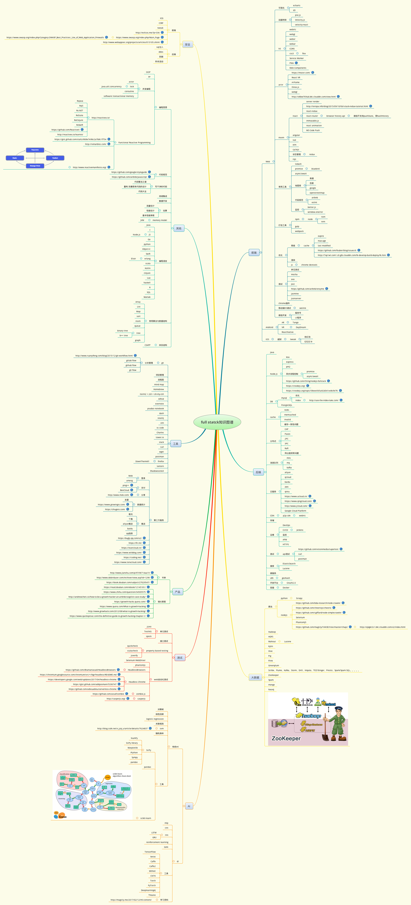
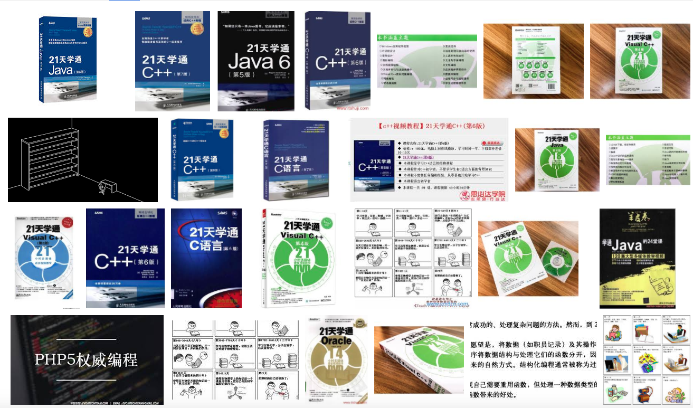

# Web前端 => 全栈
<small>Created by [Magicly](https://magicly.me)</small>

---

# 自我介绍

## 工作经历

* 2010年毕业于北京大学信息管理系，获得信息管理学士学位以及计算机软件学士学位<!-- .element: class="fragment" -->
* 酷我音乐Web开发<!-- .element: class="fragment" -->
* 人人游戏Java后台<!-- .element: class="fragment" -->
* 腾讯Web开发<!-- .element: class="fragment" -->
* 鱼说科技，大前端技术总监和CTO职位<!-- .element: class="fragment" -->
* 17年初离职，创办漫极客科技，致力于人工智能产品开发。<!-- .element: class="fragment" -->

## 使用过的技术
* Web开发： HTML/CSS/JS, React + Rudux + Webpack
* APP: React Native
* 微信小程序
* 语言： Java / Scala / Clojure / Kotlin / Groovy; Node.js; Python; PHP; C/C++/Rust; Haskell...
* Mysql
* Lucene, Mahout, Hadoop, CI / CD， 微服务， Docker， 
* AR / VR
* Tensorflow / keras
* ......

## 自我定位
做一名浪漫的极客，用科技优化生活~~<!-- .element: class="fragment" -->

---

# Web发展史

## 1994
* 网景推出了第一版Navigator
* Tim Berners-Lee创建了W3C
* 哈肯·维姆·莱和伯特·波斯合作设计CSS
* Rasmus Lerdorf发明PHP

## 1995
网景推出了JavaScript

##  1996
微软推出了iframe标签

## 1999
* W3C发布HTML4.01和XHTML1.0
* 微软推出用于异步数据传输的ActiveX
* 各大浏览器厂商模仿实现了XMLHttpRequest

## 2001
IE6发布

## 2004
[Firefox](https://zh.wikipedia.org/wiki/Firefox)发布

## 2005
[AJAX](https://zh.wikipedia.org/wiki/AJAX)概念提出

## 2006
* Firebug
* XMLHttpRequest被W3C正式纳入标准

## 2007
第一代iphone发布

## 2008
* Google Chrome发布
* T-Mobile G1，全球首款采用Google Android为操作系统的智能手机

## Chrome(1) 
<iframe width="560" height="315" src="https://www.youtube.com/embed/RrDHrwLUtvk" frameborder="0" allowfullscreen></iframe>
http://v.youku.com/v_show/id_XMTY0MTM1MDcy.html

## Chrome(2)
<iframe width="560" height="315" src="https://www.youtube.com/embed/nCgQDjiotG0" frameborder="0" allowfullscreen></iframe>
http://v.youku.com/v_show/id_XMjA3NDI0NjQ0.html

## 2009
* Javascript 5发布
* [AngularJS](https://angularjs.org/)
* Ryan Dahl开发[Node.js](https://nodejs.org/en/)
* PhoneGap
* [iPhone 3GS](https://zh.wikipedia.org/wiki/IPhone_3GS)

## 2010
* [Backbone.js](http://backbonejs.org/)
* [npm](https://www.npmjs.com/)诞生

## 2011
* [Ember.js](https://www.emberjs.com/)
* Adobe收购PhoneGap，捐献给Apach软件基金会，更名为[Apache Cordova](https://cordova.apache.org/)
* [grunt](https://github.com/gruntjs/grunt)， github第一次commit是2011.09

## 2012
* [webpack](https://github.com/webpack/webpack)， github第一次commit是2012.03

## 2013
* [React.js](https://reactjs.org/)在JSConf US上宣布开源
* [gulp](https://github.com/gulpjs/gulp)， github第一次commit是2013.07

## 2014
* [Vue.js](https://vuejs.org/)
* [HTML5](https://zh.wikipedia.org/wiki/HTML5)发布

## 2015
React Native开源

## 2016
* Weex开源
* 微信小程序发布

---

# 现在Web能干嘛(1)

## WebRTC(1)

<small>WebRTC 是一个开放标准，在浏览器里面可以直接做视频聊天或语音聊天。目前的浏览器支持情况也是十分好的，包括最新的 iOS 11，下图是 WebRTC 的浏览器支持情况。</small>

## WebRTC(2)
* https://github.com/webrtc/samples
* https://webrtc.org/start/
* https://www.html5rocks.com/en/tutorials/webrtc/basics/
* https://appr.tc/
* https://simplewebrtc.com/demo.html

##  P2P CDN

WebRTC 能够做端到端的通信，也就能实现P2P技术。 目前已经有人基于这个实现了 P2P  CDN，这可以节省很大的成本，比如[Serverless CDN](https://www.peer5.com)。

## WebGL
* http://webglsamples.org/
* https://threejs.org/
* https://www.awwwards.com/22-experimental-webgl-demo-examples.html
* https://github.com/sjfricke/awesome-webgl

## WebAssembly
<small>
* http://webassembly.org/
* https://magicly.me/fe-hpc/asmjs-and-webassembly/

webassembly的浏览器支持程度也是非常高的了，新版的火狐、Chrome、iOS、IE、Opera等都支持。
</small>

## 3D游戏
* https://media.tojicode.com/q3bsp/
* https://tanx.io/?u=goHExwaHuM34AHcN

## AR/VR
* https://github.com/jeromeetienne/ar.js
* https://webxr.io/webar-playground/app/
* https://webvr.info/
* https://aframe.io

#### 机器学习
- http://cs.stanford.edu/people/karpathy/convnetjs/
- https://deeplearnjs.org/
note: 
前端也可以做机器学习方面的内容，这里我提供两个参考链接给大家。第一个是李飞飞的高徒[Andrej Karpathy](https://twitter.com/karpathy)开发的 [ConvNetJS](http://cs.stanford.edu/people/karpathy/convnetjs/)。第二个是谷歌刚刚开源不久的 [deeplearn.js](https://deeplearnjs.org/) 库。两个库都可以直接在浏览器里训练深度神经网络。

## 数据可视化
* http://gallery.echartsjs.com/explore.html
* https://d3js.org/

---

# 现在Web能干嘛(2)

## 移动端开发
* [IONIC](http://ionicframework.com/)
* [React Native](https://github.com/facebook/react-native)
* [微信小程序](https://mp.weixin.qq.com/debug/wxadoc/dev/index.html)
* [阿里去年开源的Weex](https://weex.apache.org/cn/)

## 桌面软件开发
* [Electron](https://electron.atom.io/)
* [NW.js](https://github.com/nwjs/nw.js)
* [VSCode](https://code.visualstudio.com/)
* [Atom](https://atom.io/)
* [微信开发工具](https://mp.weixin.qq.com/debug/wxadoc/dev/devtools/devtools.html)
* [第三方微信桌面客户端](https://github.com/geeeeeeeeek/electronic-wechat)
* [Slack的桌面版本](https://slack.com/downloads/)
* [桌面版Github](https://desktop.github.com/)

---

# Web技术一统多端

## 大前端
- Web/H5
- APP（Android、iOS）
- 微信开发
- Desktop
- 数据可视化
- 视觉设计
- 新的人机交互技术，包括语音识别、计算机视觉、AR/VR 等

> Any application that can be written in JavaScript, will eventually be written in JavaScript. -- Atwood’s Law

Web 是现在最流行的真正做到跨平台运行的技术平台：PC、Web、手机、手表、TV、Kindle、电冰箱……

---

# 后端

* 网络
* 并发
* 数据库
* 微服务
* 分布式
* Docker
* CI/CD
* 运维
* ...

* 做云的
* 用云的

---

# 全栈?

## 什么是全栈
> <small>任何一方面的具体经验都不重要，重要的是思维方式和学习能力。首先说思维方式，那就是不为自己设限，不会想着自己是前端工程师，所以后端的东西我就一点也不碰。</small>

> <small>任何一个 Facebook 的问题，都不是别人的问题。</small>

> <small>Engineers are versatile minds who create links between science, technology, and society.</small>

> <small>——https://www.zhihu.com/question/22420900</small>

# 全栈 ~= 端工程师 + 云工程师

## 包括
* Web, App, 微信公众号、小程序，Desktop, AR/VR
* 网络，并发，数据库，分布式，微服务，容器，大数据，运维监控
* 测试，敏捷开发CI/CD
* 人工智能
* 版本管理，开发工具编辑器、IDE等
* 产品思维
* 商业逻辑
* ...

---

# How

## 没有捷径！

## 学习！

## 学习资料
各种MOOC
* https://www.coursera.org/
* https://cn.udacity.com/
* https://www.edx.org/
* https://www.khanacademy.org/
* https://open.163.com/
* 各个学校的公开课程
* ... 

## 学什么
学跟你现有的知识结构差异最大的、 需要思想转变的东西

## 怎么学
* 先整体后细节
* 用起来
* RTFM & RTFC

## 知行合一

## 深 vs 宽
深度优先！<!-- .element: class="fragment" -->

深到比你工作需要多一层！<!-- .element: class="fragment" -->

基础很重要！<!-- .element: class="fragment" -->

note:
基础课程
* 算法与数据结构
* 操作系统
* 网络
* 编译原理

## 写博客
* 学习总结
* 锻炼表达能力
* 增加自己的社区影响力

## 教是最好的学

## 参与社区 & 开源项目

## 尝试基于自己的兴趣做一款APP
* 产品设计
* UI设计
* Hybrid or React Native
* 域名注册，审核
* 后台， BaSS， 阿里云、腾讯云、百度云。。。
* 第三方SDK，用户登录、数据统计、支付、LBS。。。
* 发布
* 监控crash， 统计用户数据
* 收集用户反馈
* 持续迭代。。。

---

## 参考链接

- [Web 研发模式演变](https://github.com/lifesinger/blog/issues/184)
- [前端发展史](http://www.cnblogs.com/kidney/p/6079530.html)
- [怎样成为全栈工程师（Full Stack Developer）？](https://www.zhihu.com/question/22420900)
- [未来的两种软件工程师：端工程师和云工程师](https://www.xttblog.com/?p=974)

---

# THANK YOU!
<!-- .element: class="fragment" -->